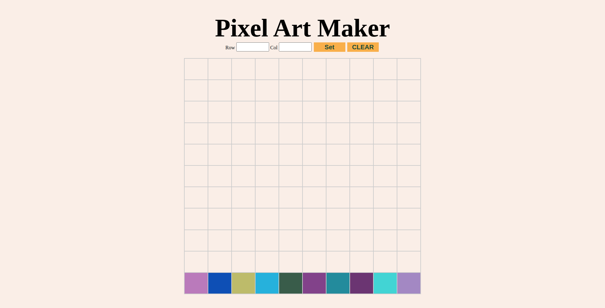

# Pixel Art Maker challenge

The challenge was to create something like this:

### Features

- Dynamically generated grid board
- on click , color of small box should be change
- we can chose color by clicking below color pallete
- on draging mouse boxes should be filled by chosen color

This was [My Solution](https://codepen.io/kmrakash/pen/dyGQWgE?__cf_chl_jschl_tk__=eeefcc3990b0bfd85e948a6e8390ab76a70d95ba-1595071490-0-ARfIudQ_Gq6_mNOE_Gij43mVeMSiFQJo4jh_8jcNmtdySliu_wy9kqqhHl5ugOhAk_u9g02G46JitqiV5izd5fVu-2DC22ZOx8hiKScaQ-sflBInDqf6OWjrxya5AKqwqJ9bLxHy_jROntaeQenL44wvUlcZcRtaFTWOXmLAFjXZr6L_6kAdSqaFfhEbxzD5t9e8vpN8y5S6UMXh1nMEifbtu_tVEvZf0LmsipcMkb9zjAip5EIs31PHwzoUu1k3xdUNLupG3Pwk45ybkIuX0Pz16f04wd7RTLnGHGlUTBsxNZJeYRhtE9E_O1ijtlrr93u8mmqnhVR_B7PBMTFQpnY) at the time of submission
